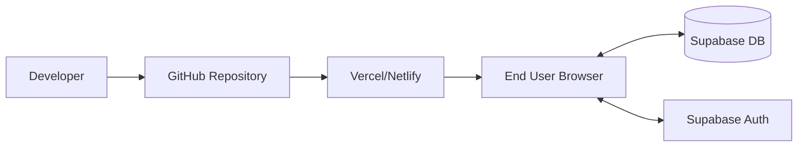

# Termly Technical Architecture

This document describes the internal workings, design patterns, and data flow of the Termly platform.

## 1. System Design

Termly follows a **Monolithic Frontend / Serverless Backend** architecture.

- **Frontend**: A single-page application (SPA) built with React and Vite. It handles all UI logic, data presentation, and local state management.
- **Backend-as-a-Service (BaaS)**: Supabase provides PostgreSQL for data storage, Auth for user management, and RLS for secure data access. No separate Node/Express server is required.
- **Data Persistence**: Highly structured PostgreSQL tables with normalized relationships for students, teachers, marks, and financials.

## 2. Core Components

### `store.js` (The Logic Engine)
The heart of the application. It acts as a **unified data layer** between Supabase and the UI components.
- **State Management**: Uses React state and effects inside custom hooks or direct async functions.
- **Abstraction**: UI components never call Supabase directly. They call functions in `store.js` (e.g., `getStudents()`, `recordPayment()`), making the codebase easier to maintain and test.
- **Real-time Sync**: Implements `subscribeToChanges()` using Supabase Channels to keep the UI in sync across different devices/tabs.

### `SuperAdmin.jsx` (The Platform Hub)
A high-privilege component that performs global aggregation.
- **KPI Calculation**: Dynamically computes revenue, school counts, and student growth.
- **Plan Management**: Visualizes seat usage against subscription limits derived from `SEAT_LIMITS`.

## 3. Data Schema Overview

| Table | Description | Primary Key | Key Foreign Keys |
| :--- | :--- | :--- | :--- |
| `schools` | Core metadata for each school entity. | `id` (UUID) | - |
| `profiles` | User accounts (Admins, Teachers, Staff). | `id` (UUID) | `school_id` |
| `students` | Student details and academic status. | `id` (UUID) | `school_id` |
| `marks` | Academic scores and assessments. | `id` (UUID) | `student_id`, `school_id` |
| `payments` | Fee transactions and M-PESA records. | `id` (UUID) | `school_id` |
| `announcements`| System and school-wide broadcast logs. | `id` (UUID) | `school_id` |
| `exam_sessions`| Formal exam configurations and timelines. | `id` (UUID) | `school_id`, `period_id` |
| `library_books`| School catalog, ISBNs, and borrowing state.| `id` (UUID) | `school_id` |
| `platform_settings`| Global pricing, billing instructions, and APK links. | `id` | - |

## 4. Key Design Patterns

- **Glassmorphism UI**: Uses translucent backgrounds, subtle gradients, and high-contrast typography for a "premium" SaaS feel.
- **Optional Chaining Robustness**: Every major data access is protected by optional chaining (`?.`) to handle the asynchronous nature of cloud data loading.
- **Centralized Admin List**: A hardcoded `PLATFORM_ADMINS` array ensures that critical dashboards are gated both at the UI layer and the Database (RLS) layer.

## 5. Deployment Flow

